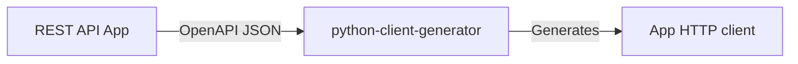

# python-client-generator

Python package to generate an [httpx](https://github.com/encode/httpx)- and
[pydantic](https://github.com/pydantic/pydantic)-based async (or sync) client off an OpenAPI spec >= 3.0 (partial specification support).



> :warning: **Currently does not support OpenAPI 2.x** (PRs for < 3.0 support are welcome).

> :exclamation: **Only partial OpenAPI specification support, if you encounter unsupported spec. please feel free to contribute to the project.**

## Using the generator

Install the package (see on [PyPi](https://pypi.org/project/python-client-generator/)):

```bash
pip install python-client-generator
```

Run:

```bash
python -m python_client_generator --open-api openapi.json --package-name foo_bar --project-name foo-bar --outdir clients
```

This will produce a Python package with the following structure:

```bash
clients
├── foo_bar
│   ├── __init__.py
│   ├── apis.py
│   ├── base_client.py
│   └── models.py
└── pyproject.toml
```

### Using PATCH functions from the generator

When calling one of the generated update functions that uses an HTTP `PATCH` method, you'll
probably want to pass the additional argument `body_serializer_args={"exclude_unset": True}`. This
will ensure that only the fields that are set in the update object are sent to the API. Example:

```python
await api_client.update_contact_v1_contacts__contact_id__patch(
    body=patch_body,
    contact_id=contact.id,
    tenant=tenant,
    body_serializer_args={"exclude_unset": True}
)
```

## Contributing

Please refer to [CONTRIBUTING.md](.github/CONTRIBUTING.md).
